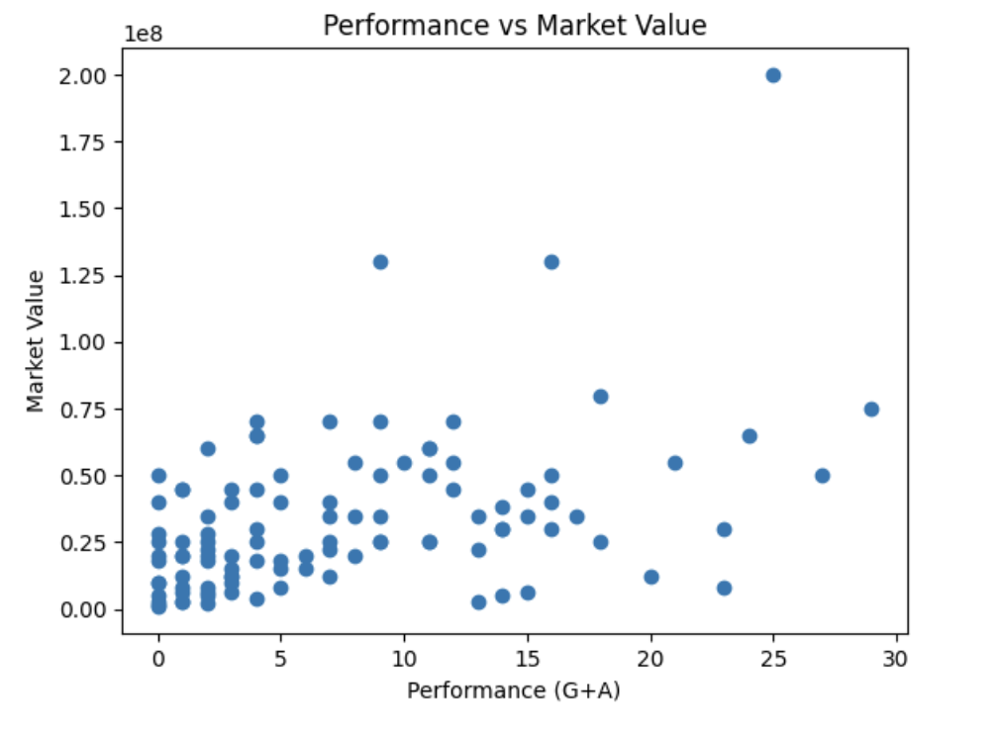
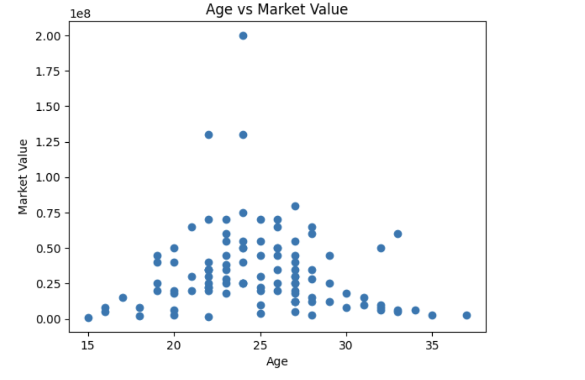
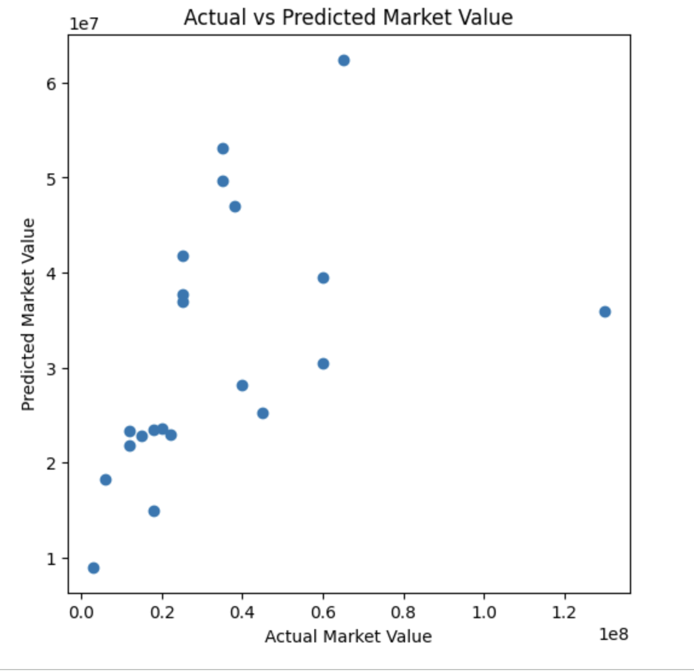
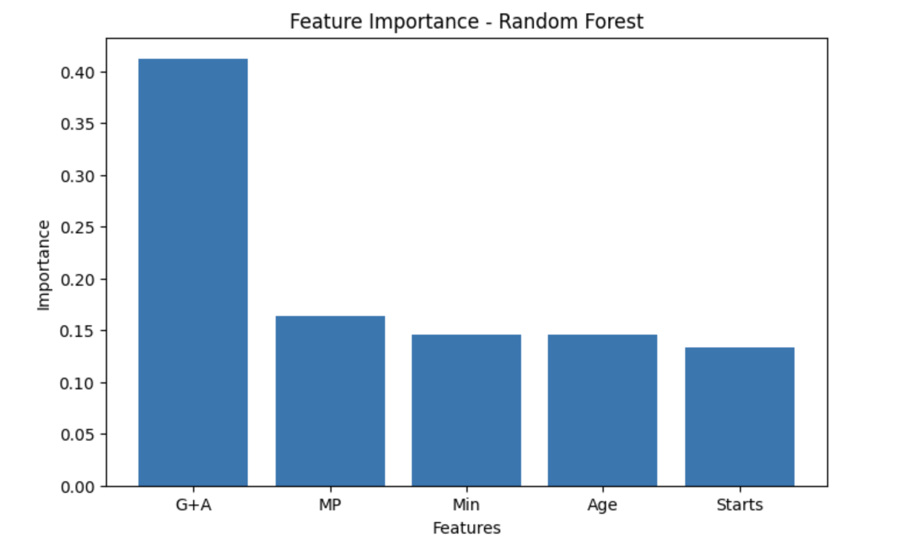

# DSA210-PROJECT
Football market value analysis

Statistical and machine learning analysis of attacking player performance and football market valuation in the 2024/2025 Premier League season.

# Analyzing the Relationship Between Player Performance and Market Value

## 1. Motivation

In modern football, player market values are influenced by many different factors such as performance statistics, age, popularity, club reputation, and league quality. Among these factors, attacking performance is often considered one of the most important indicators affecting player valuation.

This project aims to analyze whether players who produce better attacking statistics also tend to have higher market values. Using statistical analysis and machine learning techniques, the project explores the relationship between player performance indicators and market valuation.

The study focuses especially on goals, assists, and total goal contributions (G+A) to understand how strongly offensive productivity affects player market value.

---

## 2. Research Questions and Hypotheses

### Main Research Question
How does player attacking performance affect market value?

### Sub-Questions
- Do players with higher goals and assists generally have higher market values?
- Does age significantly affect player valuation?
- Which variables contribute the most to predicting market value?
- Can machine learning models predict player market values using performance statistics?

### Hypotheses

**H0:** There is no significant relationship between attacking performance (G+A) and player market value.

**H1:** Age has a significant relationship with player market value.

**H2:** Minutes played has a significant relationship with player market value.

---

# 3. Data Source and Collection

The dataset used in this project contains football player statistics including:

- Goals
- Assists
- Total goal contributions (G+A)
- Minutes played
- Match appearances
- Age
- Market value

The dataset was collected from publicly available football statistics and market valuation sources.

The market value variable was converted from text format (€m / €k) into numerical values for statistical analysis and machine learning implementation.

Missing values were removed and relevant numerical variables were cleaned before analysis.

---

# 4. Data Description

| Dataset | Variable(s) | Why used |
|---|---|---|
| Football Player Dataset | Goals (Gls), Assists (Ast), Goal Contributions (G+A) | Main attacking performance indicators |
| Football Player Dataset | Minutes Played (Min), Match Appearances (MP), Starts | Measures player participation and consistency |
| Football Player Dataset | Age | Used to analyze age effect on valuation |
| Football Player Dataset | Market Value | Main dependent variable |

---

# 5. Methodology

The project combines statistical analysis and machine learning methods.

### Statistical Analysis
- Pearson correlation analysis was used to measure the relationship between player performance and market value.
- Scatter plots and log-log plots were created to visualize relationships between variables.
- Age and market value relationships were analyzed separately.

### Machine Learning
A Linear Regression model was implemented using:
- Goals
- Assists
- Goal contributions
- Minutes played
- Match appearances
- Age

The dataset was split into training and testing sets to evaluate predictive performance.

Performance metrics:
- R² Score
- Mean Absolute Error (MAE)

---

# 6. Figures and Visualizations

## Performance vs Market Value

The scatter plot below shows the relationship between attacking performance (G+A) and player market value.

Key observation:
- Players with higher attacking contributions generally tend to have higher market values.

---

## Log-Log Relationship Plot

A log-log visualization was used to reduce the effect of extreme values and better observe the overall relationship between performance and market value.

Key observation:
- The positive relationship becomes more visible after logarithmic scaling.

## Age vs Market Value

The relationship between age and market value appears relatively weak compared to attacking performance.

Key observation:

- Younger players occasionally have very high market values, but age alone is not a strong predictor.

---

### Actual vs Predicted Market Value

The scatter plot compares actual market values with the values predicted by the machine learning model.

Key observation:

- The model captures part of the relationship between performance statistics and market value, although prediction errors are still visible.

---

### Feature Importance – Random Forest

The feature importance graph shows the contribution of each variable in the Random Forest model.

Key observation:

- G+A (Goals + Assists) had the strongest influence on predicted market value among the selected variables.
---

# 7. Machine Learning Validation

| Approach | Model | Performance | Interpretation |
|---|---|---|---|
| Regression | Linear Regression | R² ≈ 0.21 | Moderate predictive performance |
| Statistical Analysis | Pearson Correlation | r ≈ 0.44 | Moderate positive relationship |
| Error Analysis | Mean Absolute Error | ≈ 15.3 million | Predictions still affected by external factors |

### Key Finding
Simple statistical indicators and attacking performance variables explain part of player valuation, but cannot fully explain market value alone.

---

# 8. Coefficient Analysis

| Variable | Effect on Market Value |
|---|---|
| Goal Contributions (G+A) | Strong positive effect |
| Assists | Positive effect |
| Goals | Positive effect |
| Age | Negative effect |
| Minutes / Starts | Smaller contribution |

### Interpretation
The coefficient analysis suggests that attacking productivity is one of the strongest contributors to player market valuation.

Older players generally tend to have lower market values compared to younger players with similar performance levels.

---

# 9. Conclusion

This project analyzed the relationship between player performance and market value using statistical analysis and machine learning techniques.

The results showed a moderately positive relationship between attacking performance and market value. Players with higher goals and assists generally tend to have higher market values.

Age alone did not show a strong relationship with market value, while performance-related variables such as goals, assists, and total goal contributions had stronger effects.

The machine learning model achieved moderate predictive performance, suggesting that player valuation depends not only on statistics but also on additional factors such as club reputation, league quality, popularity, and player potential.

Overall, the analysis supports the idea that attacking performance is an important factor in determining player market value.

---

## 10. Limitations and Future Work

This project focuses only on attacking players from a single Premier League season.

Future studies may include multiple seasons, defensive statistics, club-level variables, and external factors such as popularity, injuries, transfer history, and international performance.

The machine learning model may also be improved by using larger datasets and more advanced prediction methods.

---

# 11. AI Usage and Academic Integrity

This project was completed in accordance with Sabancı University academic integrity and AI usage guidelines.

AI-based tools were used only for:
- debugging and improving Python code,
- assistance in report organization and formatting,
- grammar and writing support,
- interpreting statistical outputs and visualizations.
